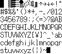

# Sword of Kumdor Latin Font

<div>

</div>
  
  
This is an extracted version of the 8x16 pixel latin font included in the 1991 touch-typing RPG “The Sword of Kumdor” (クムドールの剣).

More information about the game, including screenshots of the font [can be found here](https://lynn.github.io/kumdor/).

Thanks to [Lynn / @chordbug](https://lynn.github.io/) for publishing this excellent page which brought my attention to the game and the font, and also for answering my questions about the ROM's format.

## Character Extraction

A copy of the ROM binary (.hdm) is needed to run the extraction,
it's not included in this repo.

```sh
# Elixir 1.16.3
mix deps.get
mix extract_font <path_to_rom>
```

Each character is written to a PNG in `/output` named after its (decimal) index in the ASCII table.

## Glyph Bitmap Distribution Format Export

The [Glyph Bitmap Distribution Format (BDF)](https://en.wikipedia.org/wiki/Glyph_Bitmap_Distribution_Format) is a bitmap font format that a lot of font tools like FontForge can read and write.

Export the Kumdor font to BDF like so:

```sh
mix export_bdf <path_to_rom>
```

The file is written to `output/kumdor_latin.bdf`.

I think there is some issue with how pixel dimensions are specified as FontForge shows a warning, but it does load the font correctly.

## Other Formats

From BDF we can convert to other Bitmap font formats using this utility:

https://code.lag.net/robey/font-problems

```sh
git clone https://code.lag.net/robey/font-problems.git
cd font-problems 
npm i && npm run build
# convert to bitmap grid
./bin/font-problems ../output/kumdor_latin.bdf ../output/kumdor_latin_grid.bmp
```

